## 96TALK 🕤 - 양방향 통신 웹 메신저 서비스 📨

> 2023 서일대학교 NINETO6 팀 프로젝트

<br/>

### 🧑‍💻 팀원 소개

<table>
  <tr>
  <td align="center">
	    <a href="https://github.com/chang-seop">
	    	
	    	<br/>
	    	<sub>
	    	<b>신창섭</b>
	    	<br/>
	    	
	        </sub>
	    </a>
	    <br />
	</td>
  <td align="center">
	    <a href="https://github.com/ezurno">
	    	
	    	<br/>
	    	<sub>
	    	<b>이준모</b>
	    	<br/>
	    	
	        </sub>
	    </a>
	</td>
  </tr>
</table>

<br/>

<hr/>

### ⚡프로젝트 소개

> 2023.06 - 2023.11

**양방향 통신 웹 메신저 서비스**

평소에 자주쓰던 'KAKAOTALK', 'LINE' 을 보며 웹에서도 구현해볼 수 있을까? 라는 의문에 시작하게 된 프로젝트.

웹 브라우저에는 채팅방을 생성하여 실시간으로 채팅할 수 있는 플랫폼이 많이 없다고 생각했었는데

비 연결성 프로토콜인 `Http` 통신 방식에 관해 공부하고 있던 중 `Websocket` 과 같은 양방향 네트워크 프로토콜 기반으로 동작하는

`Simple Text Oriented Messaging Protocol(STOMP)`에 대해 알게 되어 구현해 보고자 했다.

 <ul>
  <li>실시간으로 서로의 채팅을 볼 순 없을까? 연결형 프로토콜을 사용하자!</li>
  <li>전송 후에 연결이 끊기는 `HTTP` 를 유지 할 순 없을까? `WebSocket` 을 활용하자! 클라이언트와 서버 간에 데이터를 양방향으로 전송</li>
  <li>메세지를 보냄으로서 생기는 지연은 어떻게 해결할까? `Message Broker` 를 사용하자!</li>
</ul>

<hr/>
<br/>

### ⚙️ 기술 정보

#### Frontend

<div>


</div>

#### Backend

<div>


</div>

#### Tool

<div>


</div>

<br/>
<hr/>

### 🚧 버전 관리 및 진행

#### Ver 1.0

- [x] ERD 설계 및 DB 테이블 생성
- [x] Spring Security 설정
- [x] Access Token 구현 및 인증 방식 추가 (JWT, 토큰 만료 30분, Authorization 헤더에 Bearer 타입, 휘발성)
- [x] Refreash Token 구현 (Session 방식, 쿠키 만료 3일, Redis 사용) 
- [x] Refresh Token으로 Access Token, Refresh Token 재발급 구현
- [x] VMWare 리눅스 설치 및 설정 
- [x] nginx 설치 및 설정
- [x] SSL, TLS 인증서 등록 (HTTPS)
- [x] Swagger로 API 관리
- [x] Refresh Token 보안 설정 (httpOnly, secure)
- [x] 로그인, 회원가입 구현 
- [x] 프로필 수정, 프로필 상세 메세지
- [x] 친구추가 및 채팅방 개설 구현
- [x] 친구목록 조회 구현
- [x] 채팅리스트 조회 구현
- [x] 실시간 채팅 구현
- [x] 채팅 버블 및 안읽은 채팅 표시 구현
- [x] 채팅 기능을 응용하여 알람 기능 구현
- [x] 각 요청 예외 처리 및 버그 수정

#### Ver 2.0

- [ ] 채팅방 채팅 메세지 Lazy-Loading 구현 (성능 최적화)
- [ ] 단체 채팅방 구현
- [ ] 채팅방 이미지 업로드 구현
- [ ] 채팅방에 업로드 된 이미지 30일 뒤 제거 (Spring Batch 이용)

<br/>
<hr/>

## 💡 프로젝트 실행 이미지
#### 최초 화면, 로그인
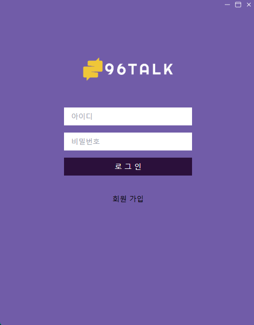
#### 회원 가입
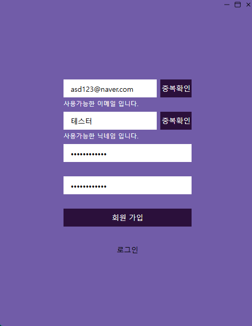
#### 로그인 후 친구 목록
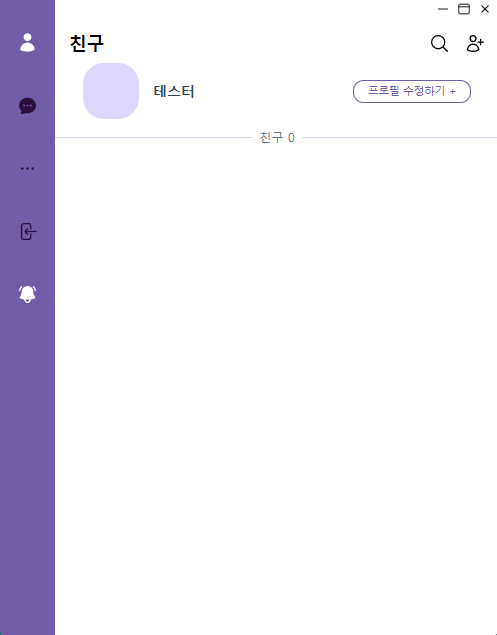
#### 프로필 상세
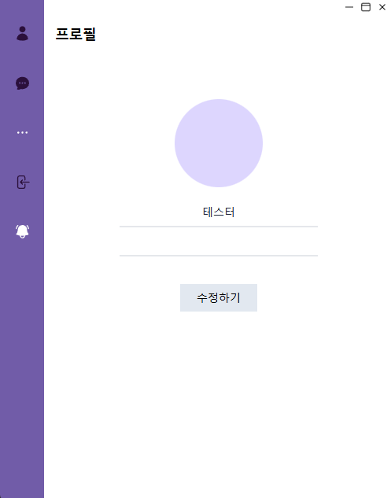
#### 프로필 수정
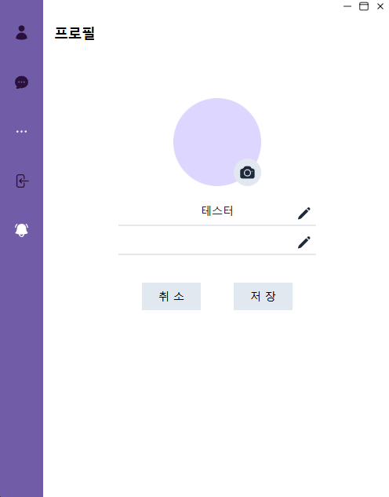
#### 카메라 버튼을 눌러 프로필 이미지 수정
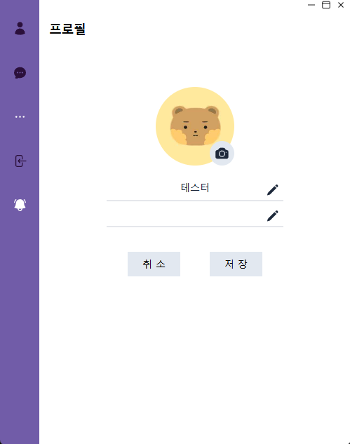
#### 프로필 사진이 수정된 친구 목록
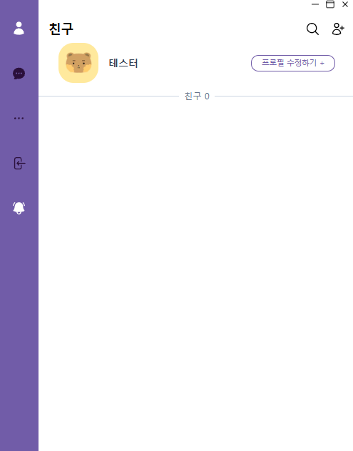
#### 친구 검색
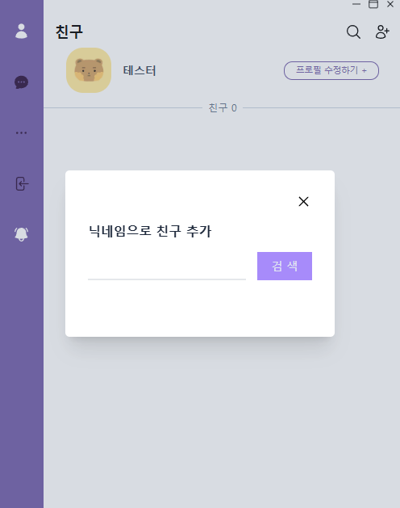
#### 검색된 친구의 프로필
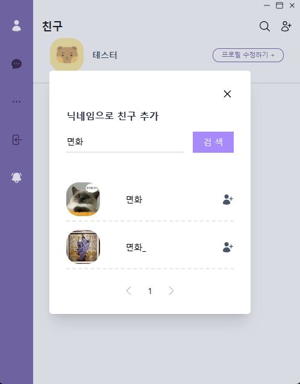
#### 친구의 프로필 상세
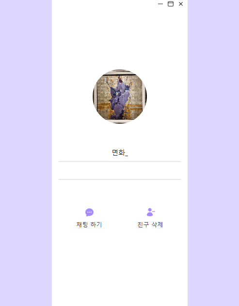
#### 친구와의 채팅창, 1:1 채팅
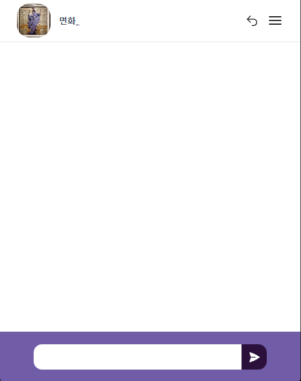
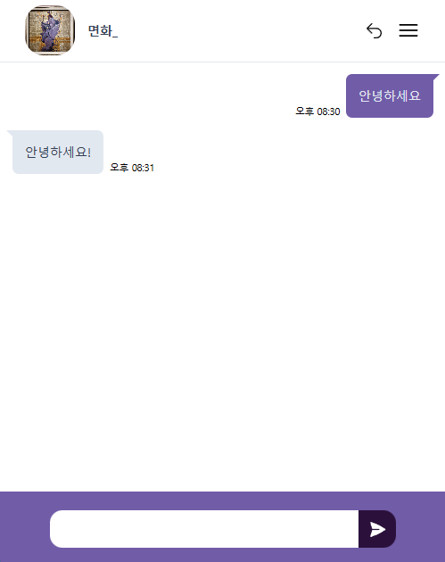
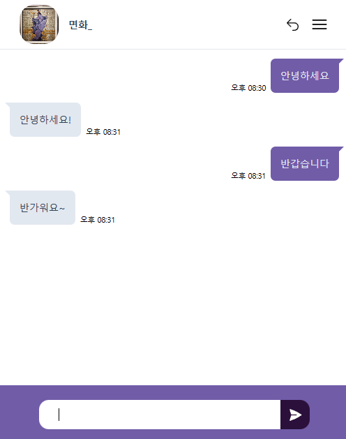
#### 친구가 추가된 친구 목록, 채팅 메세지 알람(버블)
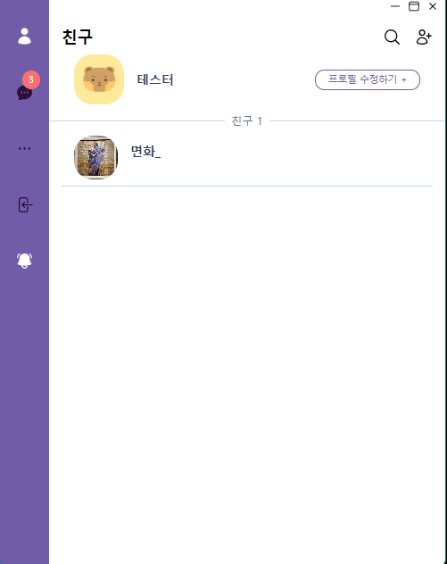
#### 메세지 미리보기, 메세지 알림
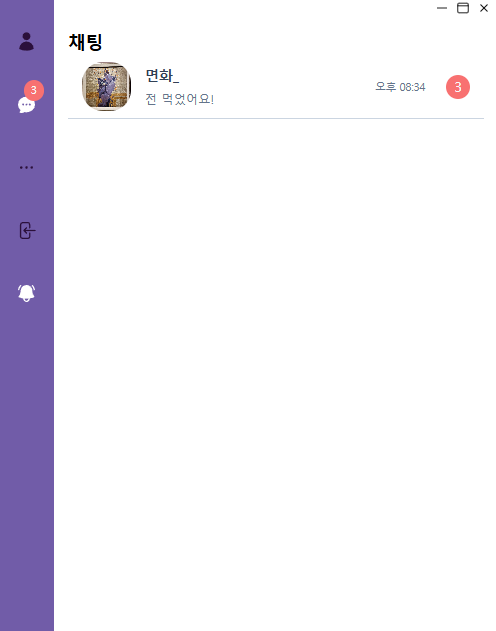
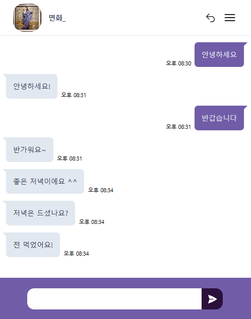
#### 채팅방을 끄게 되면 알람이 없어진 모습
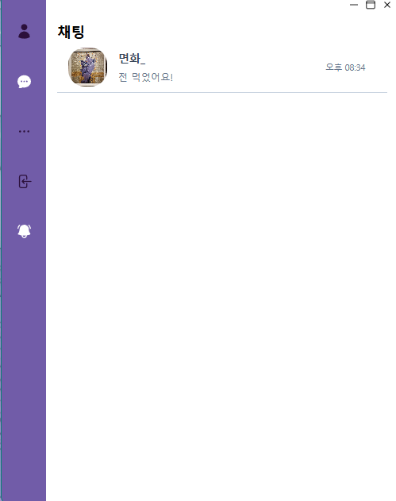
#### 채팅방 오른쪽 상단 버튼을 누른 후(토글) 채팅방 나가기

#### 채팅방을 나오게 된 모습
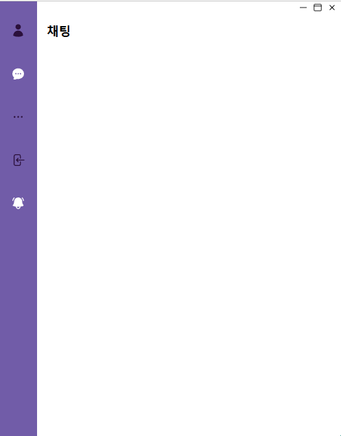

## 🔍 프로젝트 상세
#### Swagger

[Swagger API 명세서](https://nineto6.p-e.kr/api/swagger-ui/index.html#/)

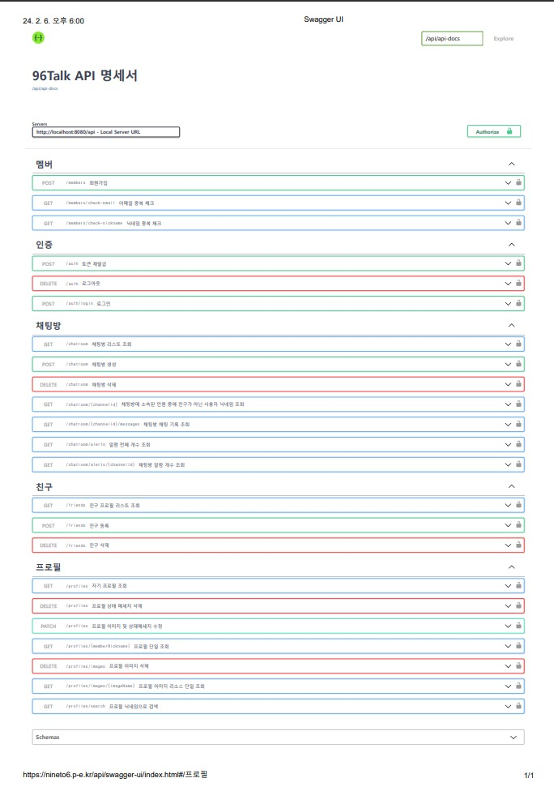

#### ERD-Cloud

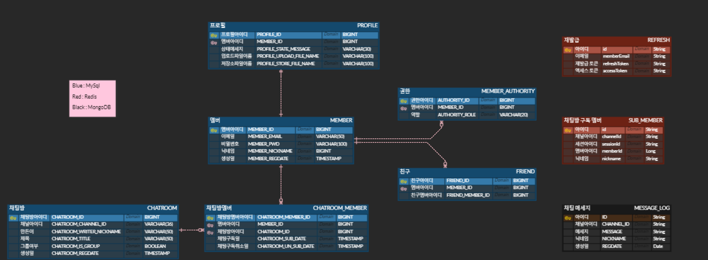

<br/>
<hr/>

### 🌳 개발 환경

#### Frontend

- Project: React ^18.2.0
- Language: typescript ^4.9.5
- Dependencies
  - react-hook-form: ^7.48.2
  - react-helmet: ^6.1.0
  - axios: ^1.6.1
  - sockjs-client: ^1.6.1
  - @stomp/stompjs: ^7.0.0
  - tailwindcss: ^3.3.5

#### Backend

- Project: Gradle
- SpringBoot: 2.7.17
- Language: Java 11
- Dependencies
  - jjwt: 0.9.1
  - json-simple: 1.1.1
  - jaxb-runtime: 2.3.2
  - springdoc-openapi-ui: 1.7.0
  - mybatis-spring-boot-starter:2.3.1
  - spring-boot-starter-security
  - spring-boot-starter-web
  - spring-boot-starter-websocket
  - spring-boot-starter-validation
  - spring-boot-starter-data-mongodb
  - spring-boot-starter-data-redis
  - spring-boot-starter-test
  - mysql-connector-j
  - lombok

<br/>
<hr/>

### 배포 과정
#### 사용 툴
- VMWare Workstation 17 player, Putty, FileZilla
- HostOS: Windows 11
- guestOS: CentOS Stream 9

#### 버전
- nginx: 1.20.1
- Redis: 6.2.7
- MySQL: 8.4.1
- MongoDB: 7.0.12
- JDK: 17.0.6

#### 순서
1. 가상 OS VM Ware 프로그램 설치
2. 운영체제 CentOS Stream 9 설치
3. Putty로 접속할 관리자 계정 생성
4. 접속은 외부 서버가 있다고 가정하여 Putty로 SSH 접속 및 파일은 FileZilla를 통해 파일 옮기기
5. Java Development Kit(JDK) 설치
6. nginx 설치, 접속 테스트
7. Host OS 공유기에 포트 포워딩 설정(80, 443), VMWare 포트 포워딩 설정(80, 443 외부 접속 허용)
8. Firewall(방화벽) 80, 443 포트 열기
9. '내도메인.한국' 무료 DNS 사용 및 Host 외부 IP 연결
10. MySQL, Redis, MongoDB 설치 및 계정 생성, 데이터베이스 생성 및 테이블 추가
11. Spring Boot 이용하여 빌드(BootJar) 후 파일 systemctl(서비스) 등록
12. Certbot 이용하여 무료 lets' encrypt SSL/TLS 설치 및 nginx.conf 파일 설정
13. 서비스 실행 및 외부 사용자 접속 테스트

#### nginx.conf
```nginx
user nginx;
worker_processes auto;
error_log /var/log/nginx/error.log;
pid /run/nginx.pid;

events {
    worker_connections 1024;
}

http {
    client_max_body_size 10M;

    upstream app {
       server 127.0.0.1:8080;
    }

    underscores_in_headers on;
    include /etc/nginx/mime.types;
    default_type application/octet-stream;

    # Redirect all Traffic to HTTPS
    server {
      listen 80;

	  location ~ /\.well-known/acme-challenge/ {
	  	allow all;
		root /var/www/letsencrypt;
	  }

      return 301 https://$host$request_uri;
    }
 
    server {
      listen 443 ssl http2;
      ssl_certificate /etc/letsencrypt/live/nineto6.p-e.kr/fullchain.pem;
      ssl_certificate_key /etc/letsencrypt/live/nineto6.p-e.kr/privkey.pem;

      # Disable SSL
      ssl_protocols TLSv1 TLSv1.1 TLSv1.2;
     
      # 통신과정에서 사용할 암호화 알고리즘
      ssl_prefer_server_ciphers on;
      ssl_ciphers ECDH+AESGCM:ECDH+AES256:ECDH+AES128:DH+3DES:!ADH:!AECDH:!MD5;

      # Enable HSTS
      # client의 browser에게 http로 어떠한 것도 load하지 말라고 규제합니다.
      add_header Strict-Transport-Security "max-age=31536000" always;

      # SSL sessions
      ssl_session_cache shared:SSL:10m;
      ssl_session_timeout 10m;
    
      # Back-End Websocket
      location ^~/api/ws/ {
        proxy_pass http://app;
 
        proxy_http_version 1.1;
        proxy_set_header Upgrade $http_upgrade;
        proxy_set_header Connection "Upgrade";
        proxy_set_header Host $host;
      }

      # Back-End API
      location ^~/api/ {
        proxy_pass http://app;
        proxy_set_header Host $host;
        proxy_set_header X-Nginx-Proxy true;
        proxy_set_header X-Real-IP $remote_addr;
        proxy_set_header X-Forwarded-For $proxy_add_x_forwarded_for;
        proxy_set_header X-Forwarded-Proto $scheme;
      }

      # Front-End React
      location / {
        root /home/ikavon/react/build;
        index index.html;
      	try_files $uri $uri/ /index.html;
      } 
    }
}
```

#### 96talk.service
```
[Unit]
Description=Service Description
After=syslog.target network.target 96talk.service

[Service]
ExecStart=/bin/bash -c "exec java -jar /home/ikavon/server/96talk/96Talk-0.0.1-SNAPSHOT.jar --spring.profiles.active=prod"
Restart=on-failure
RestartSec=10

User=root
Group=root

[Install]
WantedBy=multi-user.target
```
